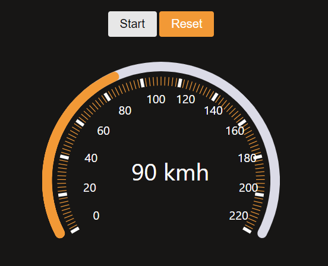

# Speedometer App

This is a React application where the speedometer gauge was made with the help of d3.js.



# How to run?

 1. Install dependencies
 
 ```sh 
 npm install
 ```
 
 2. Start the development server
 
 ```sh
 npm run
 ```

Runs the app in the development mode.
Open [http://localhost:3000](http://localhost:3000) to view it in the browser.

Also, available [here](https://travel-location.herokuapp.com/).


# Tech Stack Used:

 - [React.js](https://reactjs.org/tutorial/tutorial.html)
 - [d3.js](https://leafletjs.com/index.html)

